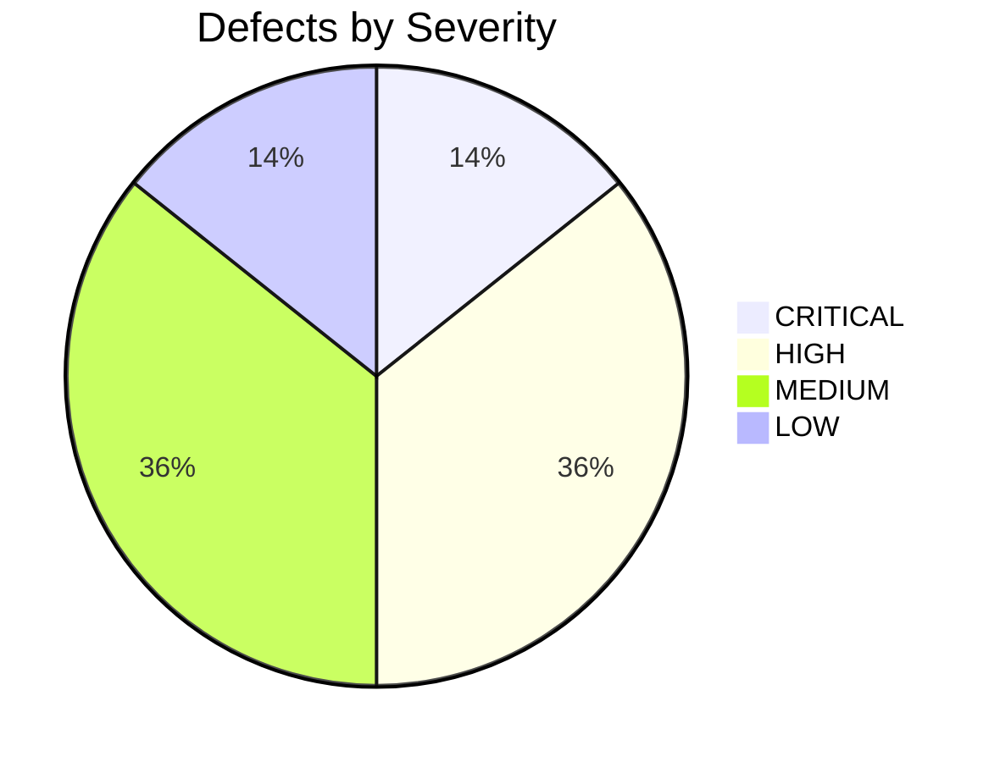

# ChatAura High-Level Design (HLD) Architecture Audit
**Principal Software Architect Evaluation: Post-Migration Implementation**

- **Date of Audit:** September 17, 2026
- **Auditor Role:** Principal Software Architect
- **Target Systems:** Next.js Web Admin (`chataura_admin`), NestJS Core Backend (`chataura_backend_nest`), PostgreSQL 16, Redis 7, Nginx, Docker Orchestration
- **Status:** Laravel → Next.js + NestJS migration already completed in codebase.
- **Rule of Engagement:** No speculative recommendations. Every architectural recommendation must be grounded in concrete technical reasons, failure modes, or scalability limits.

---

## Executive Summary

The ChatAura backend migration from a legacy PHP/Laravel stack to a NestJS 11 + Fastify + PostgreSQL 16 + Redis 7 + Next.js 14 architecture represents a significant improvement in throughput, type safety, and transactional ACID rigor.

However, an in-depth HLD audit reveals several critical architectural bottlenecks that will impair production operations, multi-instance horizontal scaling, data durability, and system security if not systematically resolved before cutover.

### Summary Assessment Matrix

| Dimension | Architectural Grade | Primary Finding |
| :--- | :---: | :--- |
| **1. Separation of Concerns** | **B+** | Good modular structure; `AdminService` acts as a God service across domains. |
| **2. Frontend/Backend Boundaries** | **B** | Clear REST API boundary; client-side CSR admin with token in `localStorage`. |
| **3. NestJS Module Boundaries** | **A-** | Clean acyclic module dependency tree; shared global infrastructure. |
| **4. Domain Boundaries** | **B+** | Clear separation between gaming, rooms, wallet, chat; minor balance duplication. |
| **5. Dependency Direction** | **A** | Unidirectional dependencies; zero circular module references. |
| **6. Coupling** | **C** | Tight coupling between web process and background timers / local file storage. |
| **7. Cohesion** | **B+** | High cohesion in financial ledger and auth; low cohesion in admin service. |
| **8. Scalability** | **D** | **Critical Blockers:** In-process game loops and in-memory WebSockets block horizontal scaling. |
| **9. Availability** | **B** | Docker health checks and Nginx fail-routing; single-container bottleneck. |
| **10. Reliability** | **A-** | Excellent ACID ledger protection (`SELECT ... FOR UPDATE`); timers prone to drift. |
| **11. Fault Isolation** | **C+** | Game loops and heavy media uploads share the same Node.js event loop as HTTP API. |
| **12. Authentication Architecture** | **B** | Solid JWT/refresh hash design; DB query on every request is a high-traffic bottleneck. |
| **13. Authorization Architecture** | **A-** | Clean RBAC pipeline (`@Roles`, `RolesGuard`, `EmailVerifiedGuard`). |
| **14. Database Architecture** | **B+** | Robust relational model (44 entities); config overrides and redundant columns exist. |
| **15. Caching Architecture** | **F** | Redis is provisioned but completely unutilized for application caching. |
| **16. Background Processing** | **F** | **Critical Defect:** No queue system (BullMQ absent); in-process `setInterval` used instead. |
| **17. Storage Architecture** | **D** | **High Risk:** Local uploads lack persistent volume mount (data loss on container recreation). |
| **18. External Integrations** | **C** | Razorpay & Agora well-integrated; GCS and FCM are non-functional stubs. |
| **19. Error-Handling Architecture** | **A** | Strict global interceptor and filter standardizing JSON error and success envelopes. |
| **20. Logging & Observability** | **C** | Fastify/Pino stdout logging; no structured APM, metrics, or distributed tracing. |
| **21. Deployment Architecture** | **B** | Multi-container Docker Compose with strict memory bounds for 8 GB VPS. |
| **22. Security Boundaries** | **B-** | Constant-time payment verification; XSS risk in admin `localStorage` token storage. |
| **23. Performance Architecture** | **B+** | Fastify provides sub-10ms baseline; DB auth query creates I/O amplification. |
| **24. Disaster Recovery** | **D** | No automated WAL archiving, offsite snapshots, or persistent media backups. |

---

## Detailed Evaluation Across 24 HLD Dimensions

### 1. Separation of Concerns
- **Observation:** Business logic is organized into feature modules. Financial ledger operations are isolated in `LedgerService`.
- **Deficiency:** `AdminService` mixes presentation, user management, package pricing, moderation, and low-level SQL updates across 15 different domains in a single 1,000-line service.

### 2. Frontend/Backend Boundaries
- **Observation:** Next.js Admin (`chataura_admin`) acts purely as a client-rendered consumer over HTTP (`fetch`).
- **Deficiency:** TypeScript DTO interfaces are manually duplicated between backend and frontend rather than shared via a monorepo workspace package. Admin authentication relies on client-side browser evaluation rather than server-side middleware / edge guards.

### 3. NestJS Module Boundaries
- **Observation:** Feature modules register their own controllers and services. Acyclic DI graph.
- **Deficiency:** `AdminModule` does not consume `UserModule`, `RoomModule`, or `WalletModule` public service interfaces; it directly queries `PrismaService` for all domain tables.

### 4. Domain Boundaries
- **Observation:** Clear business boundaries: Identity, Wallet, Party Rooms, Real-Time Games, Direct Messaging, Gamification, and Agency.
- **Deficiency:** Dual spendable balances (`coinBalance` and `walletBalance`) exist on the `User` model, forcing services to synchronize both values on every financial mutation.

### 5. Dependency Direction
- **Observation:** `AppModule` imports domain modules; domain modules import shared infrastructure (`PrismaModule`, `RedisModule`) or domain dependencies (`WalletModule`).
- **Verdict:** Compliant with Clean Architecture dependency direction. Zero circular references.

### 6. Coupling
- **Observation:** Services are loosely coupled through NestJS dependency injection.
- **Deficiency:** In-process game loops (`GameEngine`) are tightly coupled to the HTTP server process lifecycle. Local disk file uploads are tightly coupled to the container's local file system.

### 7. Cohesion
- **Observation:** `LedgerService`, `AuthService`, and `TokenService` exhibit high functional cohesion.
- **Deficiency:** `AdminService` exhibits low cohesion, serving as an omnibus controller for disparate platform concerns.

### 8. Scalability
- **Deficiency:** Horizontal scaling (running 2+ replicas of `nestjs-api`) is currently **impossible** without code failure:
  1. `GameEngine.onModuleInit()` launches `setInterval(1000)`. Multiple instances will concurrently settle the same game rounds and create duplicate payouts.
  2. WebSockets use the default in-memory `IoAdapter`. Clients connected to container A cannot receive room broadcasts emitted from container B.
  3. Uploaded files saved to container A cannot be served by container B.

### 9. Availability
- **Observation:** Docker Compose enforces container health checks for PostgreSQL (`pg_isready`) and Redis (`redis-cli ping`). Nginx provides reverse proxy routing.
- **Deficiency:** The API is a single container instance. A crash or restart causes instantaneous platform downtime.

### 10. Reliability
- **Observation:** Outstanding financial reliability. Every coin debit, credit, transfer, and bet payout runs inside `prisma.$transaction()` with explicit `SELECT ... FOR UPDATE` pessimistic locks.
- **Deficiency:** Node.js event-loop delays under heavy CPU load will cause `setInterval` timer drift, delaying game round transitions and countdowns.

### 11. Fault Isolation
- **Deficiency:** HTTP REST endpoints, real-time WebSocket gateways, media streaming uploads, and autonomous game engines run in the exact same Node.js single-threaded event loop. A CPU-heavy media upload or regex search will degrade WebSocket game tick delivery.

### 12. Authentication Architecture
- **Observation:** Standard access/refresh token pattern. Refresh tokens are stored as SHA-256 hashes in PostgreSQL.
- **Deficiency:** `JwtAuthGuard` executes a PostgreSQL read (`prisma.user.findUnique`) on every authenticated request. At 2,000 requests/second, this generates 2,000 DB read queries/second exclusively for authentication validation.

### 13. Authorization Architecture
- **Observation:** RBAC is enforced cleanly via `@Roles('admin' | 'seller' | 'agency')` and `RolesGuard`.
- **Deficiency:** Fine-grained resource-based permissions (e.g., support staff vs superadmin vs financial auditor) are not supported; role is a single flat enum.

### 14. Database Architecture
- **Observation:** PostgreSQL 16 with 44 well-indexed entities.
- **Deficiency:** `docker-compose.yml` command flags override `postgresql.conf` parameters with significantly reduced memory buffers (`shared_buffers=256MB` vs `1024MB`).

### 15. Caching Architecture
- **Deficiency:** Redis 7 is provisioned in Docker, but **zero application caching exists**. Hot read paths (user profiles, live room listings, gift catalogs, coin packages, banners) hit PostgreSQL on every invocation.

### 16. Queue/Background-Job Architecture
- **Deficiency:** **No distributed queue exists.** BullMQ / Redis Streams are absent. Background jobs are executed via crude in-memory `setInterval` loops. Push notifications cannot be queued or retried asynchronously.

### 17. File/Storage Architecture
- **Deficiency:** Uploaded media is saved to `/app/uploads` inside the container. In `docker-compose.yml`, there is **no persistent volume mount** for this directory. Recreating the container destroys all user-uploaded files.

### 18. External Integrations
- **Observation:** Razorpay payment webhooks use constant-time signature verification. Agora voice tokens use the official SDK.
- **Deficiency:** Firebase Cloud Messaging (FCM) and Google Cloud Storage (GCS) SDKs are missing from `package.json`; related code paths are non-functional stubs.

### 19. Error-Handling Architecture
- **Observation:** `AllExceptionsFilter` catches all exceptions and enforces a uniform error envelope matching Android client expectations. Fastify content parser safely handles empty bodies.

### 20. Logging & Observability
- **Deficiency:** Logs are emitted as raw strings or Fastify JSON to stdout. No distributed tracing (OpenTelemetry), no metrics endpoint (Prometheus), and no error aggregation (Sentry).

### 21. Deployment Architecture
- **Observation:** Multi-container Docker Compose with memory and CPU resource caps tailored for a 2 vCPU / 8 GB RAM VPS.
- **Deficiency:** Missing container volume for `/app/uploads`; Nginx configuration lacks SSL/TLS termination definitions in `default.conf`.

### 22. Security Boundaries
- **Observation:** Passwords hashed with bcrypt (salt rounds 10); payments verified with HMAC-SHA256 constant-time checks; unprivileged Docker user (`USER node`).
- **Deficiency:** Admin JWT token stored in browser `localStorage`, creating XSS vulnerability. Development fallbacks allow unverified Google tokens.

### 23. Performance Architecture
- **Observation:** Fastify HTTP engine delivers sub-5ms routing overhead.
- **Deficiency:** Database connection pool is capped at 25 (`connection_limit=25`). Under high CCU with concurrent transactions, connection starvation can occur.

### 24. Disaster Recovery Considerations
- **Deficiency:** No automated backup scripts, WAL archiving, or offsite snapshot synchronization are defined in the repository.

---

## Architectural Problem Reports

The following catalog identifies every concrete architectural defect discovered in the codebase, categorized by severity.



---

### [HLD-01] In-Process `setInterval` Game Engine Blocks Horizontal Scaling

- **Severity:** `CRITICAL`
- **Location:**
  - [`chataura_backend_nest/src/modules/game/game.engine.ts:13`](file:///Users/ashishtayal/AndroidStudioProjects/ChatAura/chataura_backend_next/chataura_backend_nest/src/modules/game/game.engine.ts#L13)
  - [`chataura_backend_nest/src/modules/game/game.service.ts:579`](file:///Users/ashishtayal/AndroidStudioProjects/ChatAura/chataura_backend_next/chataura_backend_nest/src/modules/game/game.service.ts#L579)
- **Current Design:**
  The autonomous betting games (Greedy and Lucky77) execute via an in-memory `setInterval(() => this.games.tick(), 1000)` initialized on `onModuleInit()` inside the web API server process.
- **Why It Is Problematic:**
  1. **Horizontal Scaling Impossibility:** If the NestJS API container is scaled to 2 or more replicas behind Nginx or a load balancer, each container will run its own independent `setInterval` timer. This results in duplicate round creation, concurrent settlement attempts, double-crediting of winners, and immediate financial ledger corruption.
  2. **Process Lifecycle Fragility:** If the web process undergoes garbage collection pauses or restarts during an app update, the game round freezes or terminates mid-countdown.
  3. **Event Loop Contention:** Running database aggregations and settlement queries every second inside the HTTP thread introduces latency jitter for incoming REST API requests.
- **Recommended Architecture:**
  1. Decouple game execution from the HTTP API process.
  2. Implement a distributed singleton worker using **BullMQ on Redis** with repeatable jobs, or a dedicated standalone worker process container (`worker-engine`) that owns the 1-second tick.
  3. Use Redis distributed locks (`Redlock` or Redis `SET NX EX`) to guarantee that exactly one worker instance can execute round settlements at any given millisecond.
- **Migration Impact:**
  Requires extracting `GameEngine` into a standalone worker module/container or introducing BullMQ repeatable jobs. No database schema changes required.
- **Requires Code Change:** **YES.**

---

### [HLD-02] Ephemeral File Uploads Storage Without Persistent Volume

- **Severity:** `CRITICAL`
- **Location:**
  - [`chataura_backend_next/docker-compose.yml:18-48`](file:///Users/ashishtayal/AndroidStudioProjects/ChatAura/chataura_backend_next/docker-compose.yml#L18-L48)
  - [`chataura_backend_nest/src/main.ts:40`](file:///Users/ashishtayal/AndroidStudioProjects/ChatAura/chataura_backend_next/chataura_backend_nest/src/main.ts#L40)
  - [`chataura_backend_nest/src/modules/media/media.service.ts:417`](file:///Users/ashishtayal/AndroidStudioProjects/ChatAura/chataura_backend_next/chataura_backend_nest/src/modules/media/media.service.ts#L417)
- **Current Design:**
  Media uploads (user avatars, posts, reels) are streamed directly to local disk at `/app/uploads` inside the `nestjs-api` container. In `docker-compose.yml`, only `postgres_data` and `redis_data` have volume mappings. There is **no volume mapped for `/app/uploads`**.
- **Why It Is Problematic:**
  1. **Permanent Data Loss:** Re-deploying, rebuilding, or recreating the `nestjs-api` container (`docker compose down && docker compose up`) immediately wipes the container's writable filesystem layer, permanently deleting all user uploads.
  2. **Multi-Instance Inconsistency:** In a multi-instance setup, files uploaded to instance A are not accessible by instance B.
- **Recommended Architecture:**
  - **Immediate VPS Solution:** Add a named or bind-mounted Docker volume in `docker-compose.yml` mapped to host storage:
    ```yaml
    volumes:
      - uploads_data:/app/uploads
    ```
  - **Strategic Production Solution:** Implement an S3/GCS object storage driver using `@aws-sdk/client-s3` or `@google-cloud/storage`, storing media in an external cloud bucket and serving via CDN.
- **Migration Impact:**
  Zero downtime. Updating `docker-compose.yml` to mount a volume requires a container recreation with persistence preserved.
- **Requires Code Change:** **YES** (Configuration in `docker-compose.yml` immediately; storage driver strategically).

---

### [HLD-03] Single-Instance Socket.IO In-Memory Adapter

- **Severity:** `HIGH`
- **Location:**
  - [`chataura_backend_nest/src/main.ts:39`](file:///Users/ashishtayal/AndroidStudioProjects/ChatAura/chataura_backend_next/chataura_backend_nest/src/main.ts#L39)
  - [`chataura_backend_nest/src/modules/room/room.gateway.ts:13`](file:///Users/ashishtayal/AndroidStudioProjects/ChatAura/chataura_backend_next/chataura_backend_nest/src/modules/room/room.gateway.ts#L13)
- **Current Design:**
  The WebSocket gateway uses NestJS's default `IoAdapter(app)`:
  ```typescript
  app.useWebSocketAdapter(new IoAdapter(app));
  ```
- **Why It Is Problematic:**
  1. **Broadcast Isolation:** The default adapter stores connected sockets and room subscriptions in process memory. If the backend scales horizontally to 2 containers, an event emitted on container A (such as `room:seat_updated` or `room:gift_overlay`) will never reach clients connected to container B.
  2. **Inability to Scale Party Rooms:** A single party room cannot support large audiences distributed across server instances.
- **Recommended Architecture:**
  Implement the Redis Socket.IO adapter using `@socket.io/redis-adapter` backed by the existing Redis container:
  ```typescript
  export class RedisIoAdapter extends IoAdapter {
    createIOServer(port: number, options?: ServerOptions) {
      const pubClient = createClient({ url: process.env.REDIS_URL });
      const subClient = pubClient.duplicate();
      const server = super.createIOServer(port, options);
      server.adapter(createAdapter(pubClient, subClient));
      return server;
    }
  }
  ```
- **Migration Impact:**
  Install `@socket.io/redis-adapter` and configure the adapter in `main.ts`. Transparent to mobile clients.
- **Requires Code Change:** **YES.**

---

### [HLD-04] Database-Bound Authentication Pipeline

- **Severity:** `HIGH`
- **Location:**
  - [`chataura_backend_nest/src/common/guards/jwt-auth.guard.ts:53`](file:///Users/ashishtayal/AndroidStudioProjects/ChatAura/chataura_backend_next/chataura_backend_nest/src/common/guards/jwt-auth.guard.ts#L53)
- **Current Design:**
  `JwtAuthGuard` is registered globally via `APP_GUARD`. On every single non-public HTTP request, after cryptographically verifying the JWT, it executes:
  ```typescript
  const user = await this.prisma.user.findUnique({ where: { id: userId } });
  ```
- **Why It Is Problematic:**
  1. **Database I/O Amplification:** Every authenticated API call (polling, chat, room updates, feeds) forces a synchronous database query to the `users` table. At 2,000 requests/sec, PostgreSQL must execute 2,000 queries/sec solely to re-verify that the user is not suspended or deleted.
  2. **Connection Starvation:** With a connection pool limit of 25 (`connection_limit=25`), short-lived database reads in the guard compete with financial transactions for available connections.
- **Recommended Architecture:**
  Implement a fast Redis cache layer for user authorization status:
  - Cache user account status in Redis under `user:status:<userId>` (`active`, `suspended`, `deleted`) with a 60-second TTL.
  - When an admin suspends or deletes a user, immediately invalidate or overwrite the Redis key.
  - Fall back to PostgreSQL only on cache misses. This eliminates ~95% of database auth queries.
- **Migration Impact:**
  Zero breaking changes. Pure internal optimization inside `JwtAuthGuard`.
- **Requires Code Change:** **YES.**

---

### [HLD-05] Missing Push Notification Worker (FCM SDK Absent)

- **Severity:** `HIGH`
- **Location:**
  - [`chataura_backend_nest/package.json:27-53`](file:///Users/ashishtayal/AndroidStudioProjects/ChatAura/chataura_backend_next/chataura_backend_nest/package.json#L27-L53)
  - [`chataura_backend_nest/src/modules/user/user.service.ts:654`](file:///Users/ashishtayal/AndroidStudioProjects/ChatAura/chataura_backend_next/chataura_backend_nest/src/modules/user/user.service.ts#L654)
- **Current Design:**
  The mobile client registers hardware push tokens via `POST /api/v1/user/update-fcm-token`, and the token is stored in `User.fcmToken`. However, `firebase-admin` is **not installed**, and there is no service or worker to dispatch push notifications for offline 1-1 messages, friend requests, or party room invites.
- **Why It Is Problematic:**
  Mobile users who background the app or lock their screens will not receive notifications for incoming direct messages, friend requests, or star creator alerts, violating core social app user experience expectations.
- **Recommended Architecture:**
  1. Install `firebase-admin`.
  2. Create a dedicated `NotificationService` backed by a BullMQ background queue to dispatch push notifications asynchronously without blocking HTTP request threads.
- **Migration Impact:**
  Additive change. Requires setting up a Firebase service account key JSON.
- **Requires Code Change:** **YES.**

---

### [HLD-06] Next.js Admin Token Storage in LocalStorage

- **Severity:** `HIGH`
- **Location:**
  - [`chataura_admin/app/login/page.tsx:33`](file:///Users/ashishtayal/AndroidStudioProjects/ChatAura/chataura_backend_next/chataura_admin/app/login/page.tsx#L33)
  - [`chataura_admin/app/(dashboard)/users/page.tsx:38`](file:///Users/ashishtayal/AndroidStudioProjects/ChatAura/chataura_backend_next/chataura_admin/app/%28dashboard%29/users/page.tsx#L38)
- **Current Design:**
  Upon successful login, the admin JWT token is written directly to `window.localStorage.setItem('ca_admin_token', token)` and read in client-side React components for API requests.
- **Why It Is Problematic:**
  1. **XSS Vulnerability:** Any Cross-Site Scripting (XSS) vulnerability in the admin web app (e.g. from rendering un-sanitized user profile names, room titles, or media captions) allows malicious scripts to extract `ca_admin_token` and compromise the superadmin account.
  2. **No SSR Protection:** The Next.js server cannot inspect tokens stored in browser `localStorage`, preventing server-side authentication guards in `middleware.ts`.
- **Recommended Architecture:**
  1. Transition admin token storage to an `httpOnly`, `Secure`, `SameSite=Strict` cookie.
  2. Implement Next.js `middleware.ts` to validate the session cookie on every request, redirecting unauthenticated traffic before HTML rendering begins.
- **Migration Impact:**
  Changes how the login page saves the session. Internal to `chataura_admin`.
- **Requires Code Change:** **YES.**

---

### [HLD-07] Lack of Automated Database Backups & Disaster Recovery

- **Severity:** `HIGH`
- **Location:**
  - [`chataura_backend_next/docker-compose.yml:66-98`](file:///Users/ashishtayal/AndroidStudioProjects/ChatAura/chataura_backend_next/docker-compose.yml#L66-L98)
- **Current Design:**
  PostgreSQL data is stored in a local Docker volume (`postgres_data`). No automated backup scripts, continuous WAL archiving, or offsite snapshot routines are defined in the repository.
- **Why It Is Problematic:**
  1. **Catastrophic Hardware Loss:** If the production VPS experiences storage corruption, kernel panics, or cloud provider termination, all financial ledgers, user accounts, and room histories are permanently unrecoverable.
  2. **RPO / RTO Failure:** Recovery Point Objective (RPO) is undefined and recovery time is unbounded.
- **Recommended Architecture:**
  1. Deploy a lightweight automated backup sidecar container (e.g., `prodrigestivill/postgres-backup-local` or a cron container running `pg_dump`) that dumps database state every 6 hours.
  2. Stream compressed backups to an offsite S3-compatible cloud storage bucket.
- **Migration Impact:**
  Infrastructure-only addition in `docker-compose.yml`. No code changes required.
- **Requires Code Change:** **NO** (DevOps / Docker orchestration change).

---

### [HLD-08] Complete Absence of Application Caching on Hot Read Paths

- **Severity:** `MEDIUM`
- **Location:**
  - [`chataura_backend_nest/src/common/redis/redis.service.ts`](file:///Users/ashishtayal/AndroidStudioProjects/ChatAura/chataura_backend_next/chataura_backend_nest/src/common/redis/redis.service.ts)
  - [`chataura_backend_nest/src/modules/room/room.service.ts:52`](file:///Users/ashishtayal/AndroidStudioProjects/ChatAura/chataura_backend_next/chataura_backend_nest/src/modules/room/room.service.ts#L52)
  - [`chataura_backend_nest/src/modules/wallet/wallet.service.ts:54`](file:///Users/ashishtayal/AndroidStudioProjects/ChatAura/chataura_backend_next/chataura_backend_nest/src/modules/wallet/wallet.service.ts#L54)
- **Current Design:**
  Redis 7 is deployed, but is only used for temporary OTP verification codes. Frequently polled endpoints (`GET /rooms`, `GET /wallet/packages`, `GET /wallet/gifts`, `GET /game/greedy/leaderboard`, `GET /media/banners`) query PostgreSQL directly on every call.
- **Why It Is Problematic:**
  High read volume on catalog data and room feeds consumes database CPU and connection pool slots that should be reserved for ACID financial writes.
- **Recommended Architecture:**
  Introduce Redis caching with appropriate TTLs:
  - Coin packages & gift catalog: Cache for 1 hour; invalidate on admin catalog mutation.
  - Active live room feed: Cache with a 3-second TTL or invalidate on room open/close.
  - Game leaderboard: Cache with a 10-second TTL.
- **Migration Impact:**
  Additive performance optimization inside respective services.
- **Requires Code Change:** **YES.**

---

### [HLD-09] Redundant Database Schema Columns

- **Severity:** `MEDIUM`
- **Location:**
  - [`chataura_backend_nest/prisma/schema.prisma:56-57`](file:///Users/ashishtayal/AndroidStudioProjects/ChatAura/chataura_backend_next/chataura_backend_nest/prisma/schema.prisma#L56-L57)
  - [`chataura_backend_nest/prisma/schema.prisma:54-55`](file:///Users/ashishtayal/AndroidStudioProjects/ChatAura/chataura_backend_next/prisma/schema.prisma#L54-L55)
- **Current Design:**
  The `User` model maintains duplicated data columns:
  - `coinBalance` (`coin_balance`) and `walletBalance` (`wallet_balance`) both store spendable coins.
  - `exp` and `xp` both store user level experience points.
  - `privateAccount` and `isPrivate` both store privacy flags.
- **Why It Is Problematic:**
  1. **Data Drift Risk:** Every service method updating balances must remember to increment/decrement both columns identically. A bug in any service that updates one without the other results in state inconsistency.
  2. **Storage Overhead:** Redundant 64-bit integer columns across millions of user rows inflate table and index size.
- **Recommended Architecture:**
  Standardize on a single canonical column in PostgreSQL (`coin_balance` and `xp`). Map legacy aliases (`wallet_balance`, `exp`) purely at the serialization layer in `user.serializer.ts`.
- **Migration Impact:**
  Requires a Prisma database migration to deprecate the redundant columns and a one-time data sync.
- **Requires Code Change:** **YES.**

---

### [HLD-10] Insecure Development Fallbacks in Authentication

- **Severity:** `MEDIUM`
- **Location:**
  - [`chataura_backend_nest/src/modules/auth/auth.service.ts:501`](file:///Users/ashishtayal/AndroidStudioProjects/ChatAura/chataura_backend_next/chataura_backend_nest/src/modules/auth/auth.service.ts#L501)
  - [`chataura_backend_nest/src/modules/auth/otp.service.ts:67`](file:///Users/ashishtayal/AndroidStudioProjects/ChatAura/chataura_backend_next/chataura_backend_nest/src/modules/auth/otp.service.ts#L67)
- **Current Design:**
  1. In `AuthService.verifyGoogleIdToken()`: If `GOOGLE_CLIENT_ID` is unset, it decodes the JWT payload without verifying its signature.
  2. In `OtpService.sendEmail()`: If `SMTP_HOST` is unset, the OTP code is returned in the API response payload (`data.dev_otp`).
- **Why It Is Problematic:**
  If an operator accidentally deploys to staging or production with `GOOGLE_CLIENT_ID` or `SMTP_HOST` omitted, arbitrary users can forge Google auth tokens to log into any account, and OTP verification becomes trivial to bypass.
- **Recommended Architecture:**
  Enforce strict environment guardrails:
  - In `production` environment (`NODE_ENV === 'production'`), throw a fatal initialization error if `GOOGLE_CLIENT_ID` or `SMTP_HOST` is missing.
  - Never return `dev_otp` in HTTP responses when `NODE_ENV === 'production'`.
- **Migration Impact:**
  Zero impact on valid environments; prevents silent security misconfigurations.
- **Requires Code Change:** **YES.**

---

### [HLD-11] `AdminService` God-Class Bypassing Domain Encapsulation

- **Severity:** `MEDIUM`
- **Location:**
  - [`chataura_backend_nest/src/modules/admin/admin.service.ts`](file:///Users/ashishtayal/AndroidStudioProjects/ChatAura/chataura_backend_next/chataura_backend_nest/src/modules/admin/admin.service.ts)
- **Current Design:**
  `AdminService` directly executes Prisma queries against users, rooms, seats, gifts, banners, packages, and ledger tables, bypassing the corresponding domain services (`UserService`, `RoomService`, `WalletService`).
- **Why It Is Problematic:**
  1. **Domain Logic Inconsistency:** When an admin suspends a user or changes a package, any domain validation rules, event emissions, or cache invalidations defined in `UserService` or `WalletService` are completely bypassed.
  2. **Maintenance Drag:** The service is nearly 1,000 lines long, making changes high-risk and difficult to unit test.
- **Recommended Architecture:**
  Refactor `AdminService` to act as an orchestrator that delegates operations to dedicated domain services (e.g. `UserService.suspend()`, `RoomService.closeByAdmin()`).
- **Migration Impact:**
  Internal refactoring within NestJS. No API contract or database changes.
- **Requires Code Change:** **YES.**

---

### [HLD-12] Lack of Centralized Logging, Tracing, and Metric Observability

- **Severity:** `MEDIUM`
- **Location:**
  - [`chataura_backend_nest/src/main.ts:20`](file:///Users/ashishtayal/AndroidStudioProjects/ChatAura/chataura_backend_next/chataura_backend_nest/src/main.ts#L20)
  - [`chataura_backend_nest/src/common/filters/all-exceptions.filter.ts:49`](file:///Users/ashishtayal/AndroidStudioProjects/ChatAura/chataura_backend_next/chataura_backend_nest/src/common/filters/all-exceptions.filter.ts#L49)
- **Current Design:**
  Errors and HTTP events are logged to stdout via standard NestJS `Logger` and Fastify's default logger.
- **Why It Is Problematic:**
  Under high CCU, diagnosing intermittent payment failures, WebSocket disconnects, or database deadlocks from raw container logs is slow and ineffective. There are no metrics on latency percentiles (p95/p99) or transaction throughput.
- **Recommended Architecture:**
  1. Standardize on structured JSON logging (Pino).
  2. Implement an `/api/v1/metrics` endpoint exposing Prometheus metrics (request duration, active WebSocket connections, DB pool utilization).
  3. Integrate Sentry for real-time error tracking and alerting.
- **Migration Impact:**
  Non-invasive additions to NestJS pipeline.
- **Requires Code Change:** **YES.**

---

### [HLD-13] Configuration Drift Between `postgresql.conf` and `docker-compose.yml`

- **Severity:** `LOW`
- **Location:**
  - [`chataura_backend_next/docker-compose.yml:78-83`](file:///Users/ashishtayal/AndroidStudioProjects/ChatAura/chataura_backend_next/docker-compose.yml#L78-L83)
  - [`chataura_backend_nest/docker/postgres/postgresql.conf:7-10`](file:///Users/ashishtayal/AndroidStudioProjects/ChatAura/chataura_backend_nest/docker/postgres/postgresql.conf#L7-L10)
- **Current Design:**
  `postgresql.conf` specifies `shared_buffers = 1024MB`, `work_mem = 16MB`, `maintenance_work_mem = 256MB`. However, `docker-compose.yml` overrides these via command flags to `shared_buffers=256MB`, `work_mem=8MB`, `maintenance_work_mem=64MB`.
- **Why It Is Problematic:**
  Causes confusion during performance tuning because changes made to `postgresql.conf` are silently ignored in favor of the command-line flags.
- **Recommended Architecture:**
  Remove command-line flags from `docker-compose.yml` and manage PostgreSQL configuration exclusively through `postgresql.conf`.
- **Migration Impact:**
  One-line cleanup in `docker-compose.yml`.
- **Requires Code Change:** **NO** (DevOps configuration change).

---

### [HLD-14] Hardcoded Analytics and Mock Date Filters in Next.js Admin Dashboard

- **Severity:** `LOW`
- **Location:**
  - [`chataura_admin/app/(dashboard)/page.tsx:78-96`](file:///Users/ashishtayal/AndroidStudioProjects/ChatAura/chataura_backend_next/chataura_admin/app/%28dashboard%29/page.tsx#L78-L96)
  - [`chataura_admin/app/(dashboard)/page.tsx:103-114`](file:///Users/ashishtayal/AndroidStudioProjects/ChatAura/chataura_backend_next/chataura_admin/app/%28dashboard%29/page.tsx#L103-L114)
- **Current Design:**
  The overview dashboard displays static hardcoded strings for revenue (`"8,785"`, `"87,830"`), commission tables, and volume snapshots. The date picker is an un-wired mock component.
- **Why It Is Problematic:**
  Executives and staff viewing the dashboard make operational decisions based on fictitious numbers rather than actual platform revenue.
- **Recommended Architecture:**
  Connect the dashboard cards to backend aggregation endpoints (`GET /api/v1/admin/dashboard/analytics?from=...&to=...`) and wire the date picker inputs to dynamic state.
- **Migration Impact:**
  Pure frontend presentation enhancement.
- **Requires Code Change:** **YES.**

---

## Target Architecture Roadmap

To transition the system from the current post-migration state to an enterprise-grade production architecture, the following phased evolution is recommended:

```mermaid
graph TD
    subgraph Phase 1: Critical Stability & Durability
        P1_1[Fix Volume Mount for /app/uploads in Docker]
        P1_2[Decouple Game Loop into Distributed Worker via Redis Locks]
        P1_3[Add Redis Adapter to Socket.IO]
        P1_4[Automate Offsite Database Backups]
    end

    subgraph Phase 2: Security & Caching
        P2_1[Transition Admin Token to httpOnly Cookie]
        P2_2[Implement Redis Cache for User Auth Checks in Guard]
        P2_3[Implement Application Cache for Catalogs and Room Feeds]
        P2_4[Enforce Strict Production Env Checks for Google & SMTP]
    end

    subgraph Phase 3: Scaling & Observability
        P3_1[Introduce BullMQ for Push Notifications and Stale Cleanups]
        P3_2[Integrate Official Google Cloud Storage S3 Driver]
        P3_3[Deploy Prometheus Metrics and Pino Structured Logging]
        P3_4[Wire Dynamic Analytics in Admin Dashboard]
    end

    Phase 1 --> Phase 2 --> Phase 3
```

---

## Final Architect's Verdict

The completed Laravel → Next.js + NestJS migration has established a sound, modern foundation with exemplary financial transaction handling (`LedgerService`) and strict response contract compliance. 

However, the system in its current state is **constrained to a single-process deployment** due to the in-memory game tick loop and in-memory WebSockets, and **vulnerable to immediate media data loss** due to the missing uploads volume mount. 

Addressing **HLD-01 (Game Engine decoupling)**, **HLD-02 (Uploads volume persistence)**, and **HLD-03 (Socket.IO Redis adapter)** represents the mandatory critical path before shifting production mobile traffic away from the legacy Laravel backend.
